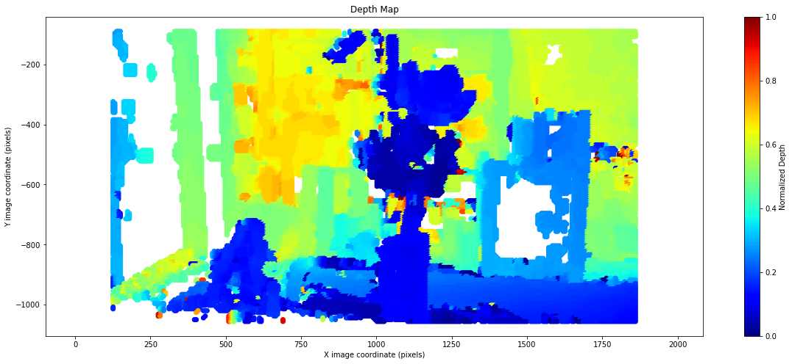
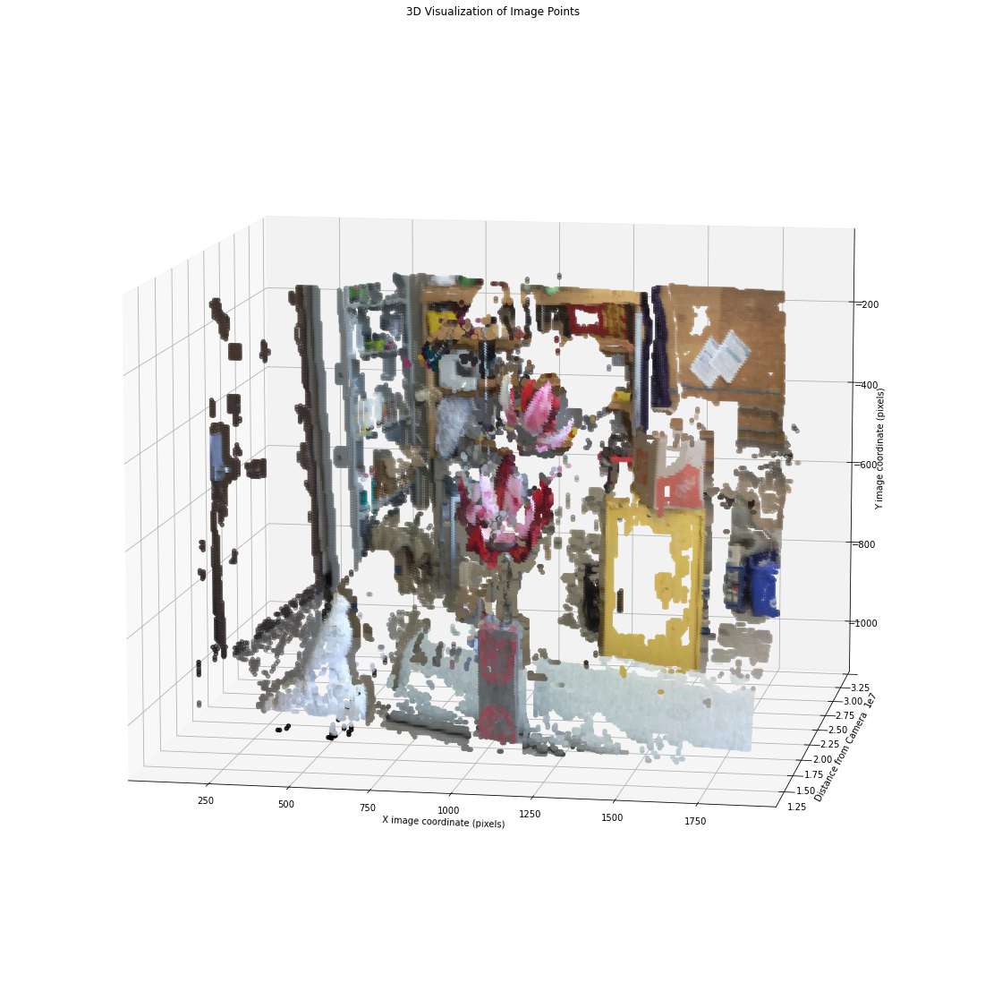
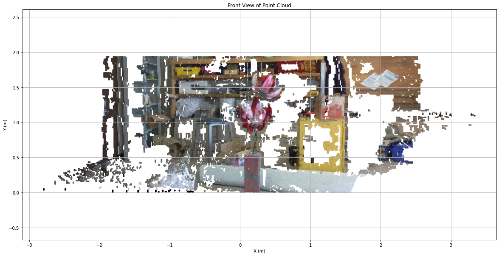
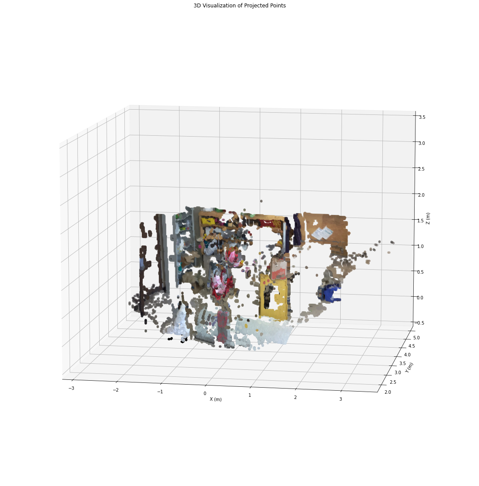

# 3D Reconstruction from Stereo Pair

The objective of this program was to use an experimental methd to perform a 3D reconstruction from a stereo pair of images with known camera calibration parameters.

Another goal was to limit the use of libraries, with only OpenCV being used for basic computer vision functions.

The input left and right images are shown below:

  
   

## Step 1: Compute initial transform
A homography matrix to roughly transform from the left to the right image was computed. This was done using SIFT detect features, FLANN to match them.

## Step 2: Feature matching
A tighly-spaced grid of overlapping feature templates was created on the left image. Smooth featureless surfaces were ignored. Next, the homography matrix was used roughly transform the template locations onto the right image. These locations were used to determine a search area in the right image for the template. The arrows in the figure below show where each feature was detected and where the search area was centered. The objects closer to the camera have the longest disparity as shown by the arrows.

## Step 3: Compute disparities and depth map
The disparitiy between each point's location in the two images was computed. The disparities were used to create a depth map as shown below.

The points were also colorized and plotted in 3d.

## Step 4: Convert image to projected coordinates
Finally, the points in image coordinates were converted to projected coordinates. The result is shown in the two figures below.

